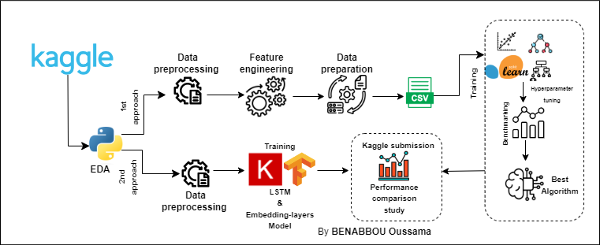

# Forecasting Wikipedia Page Views : An Exploration of Web Traffic Prediction Strategies

## Abstract
Time series analysis and forecasting are essential for comprehensive data exploration, particularly in assessing temporal data evolution. While traditional approaches often focus on univariate data, real-world scenarios involve multiple influencing components. This project delves into multivariate time series models, employing non-traditional approaches. Utilizing Wikipedia web page traffic data spanning from July 2015 to September 1st, 2017, the study contributes to advanced techniques in time series analysis and forecasting. It showcases the potential of machine learning models in predicting web traffic and lays the groundwork for future research in this domain.

## Introduction
Analyzing and forecasting web traffic is vital across various domains, contributing to secure, reliable, and high-quality web communication. Web traffic, the data transmitted and received by visitors to a website, is linked to both visitor volume and their navigation patterns. This project aims to construct a robust forecasting model for predicting future traffic on Wikipedia pages. Leveraging the Web Traffic Time Series Forecasting dataset from Google, the study explores different prediction approaches and determines the optimal number of features while maintaining high prediction accuracy.

## Project Objectives
The primary objective of this project is to construct a robust forecasting model for predicting future traffic on Wikipedia pages where we try to explore two different approaches for prediction.

For more detailed information, please refer to our project report [ResearchGate](https://www.researchgate.net/publication/378178874_Forecasting_Wikipedia_Page_Views_An_Exploration_of_Web_Traffic_Prediction_Strategies) .

## Conclusion
As a next step, we will try to work on how to make our added features more useful and try to use some advanced models with attention mechanism so that we can use all provided days of data to predict better results.